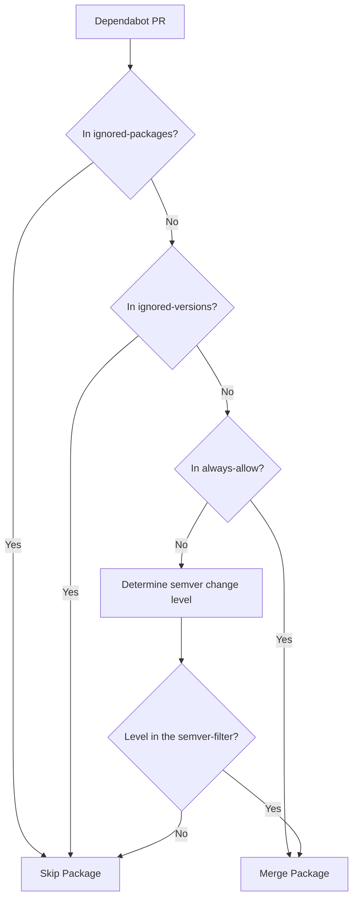

# Automerge Dependabot Github Action
[](https://github.com/navikt/automerge-dependabot/actions/workflows/tests.yml)
[](https://github.com/navikt/automerge-dependabot/actions/workflows/dependabot/dependabot-updates)
[](https://github.com/navikt/automerge-dependabot/actions/workflows/github-code-scanning/codeql)

This action automatically merges pull requests created by Dependabot with a set of configurable rules.

## Usage

This tool can be used in two ways:

1. **As a GitHub Action** (recommended for production use)
2. **As a CLI tool** (useful for testing and one-off runs)

## Features

- Automatically merges eligible Dependabot pull requests
- Configurable minimum age for pull requests before automerging
- Blackout periods to prevent merging during specific times
- Filters for ignoring specific dependencies
- Filters for ignoring specific versions of dependencies
- Filter based on semantic versioning levels (major, minor, patch)
- Robust version comparison using the official semver npm package
- Detailed workflow summary with dependency decisions and PR status

## Inputs

### `token`

**Required** The name of the environment variable that contains the GitHub token. Default: `GITHUB_TOKEN`.

The token requires the following permissions:
- `contents: write` - To allow the merge operation to modify repository contents

Note: Using GITHUB_TOKEN will not trigger on.push events, recommend using a [github app token](https://github.com/actions/create-github-app-token) & merge-method `merge` to merge as App-login. See example below.

### `minimum-age-of-pr`

The minimum age of the pull request in days before it can be automerged. Default: `0`.

### `blackout-periods`

Periods of time when the action should not run. Multiple periods can be specified as a comma-separated list.
Formats supported:
- Days of week: `Mon,Tue,Wed`
- Time ranges: `9:00-17:00`
- Date ranges: `Dec 24-Jan 5`

Examples:
- `Sat,Sun` - Don't run on weekends
- `Dec 24-Jan 5` - Don't run during winter holidays
- `9:00-10:00` - Don't run during the daily standup
- `Mon 9:00-10:00,Wed 13:00-14:00` - Don't run during regular meetings
- `Sat,Sun,Dec 24-Jan 5,9:00-10:00` - Combination of different formats

### `ignored-dependencies`

Comma-separated list of dependencies to ignore (will not be automerged). Example: `lodash,react,express`.

### `always-allow`

Comma-separated list of patterns to always allow regardless of semver changes. This is especially useful for dependencies that don't follow semantic versioning.

- Use `*` to always allow any dependency with non-semver versioning
- Use `name:string` to match dependencies containing a specific string. For example, `name:eslint` would match `eslint`, `eslint-plugin-react`, etc.
- Use specific package names to always allow specific packages
- Use package name prefixes to allow all packages that start with that prefix. For example, `no.nav.appsec` would match `no.nav.appsec:contracts`, `no.nav.appsec:core`, etc.

Examples:
- `*` - Always allow all non-semver dependencies
- `name:aws` - Allow all dependencies with "aws" in the name
- `lodash,express` - Always allow these specific packages
- `com.example` - Allow all packages starting with "com.example" (like `com.example:core`, `com.example:utils`)

### `ignored-versions`

Comma-separated list of specific versions to ignore. Format: `package@version`.
Example: `lodash@4.17.21,axios@0.21.1`
You can also use a wildcard to ignore all versions of a specific package: `package@*`

### `semver-filter`

Filter based on semantic versioning level changes.
Comma-separated list of: `major`, `minor`, `patch`. Default: `patch,minor`.

### `merge-method`

The merge method to use when merging pull requests. Default: `merge`.
Possible values: `merge`, `squash`, `rebase`.

Note: If a repository uses GitHub branch protection with merge queues, only the `merge` method is supported. The action will warn you if you're trying to use `squash` or `rebase` with a repository that has merge queues enabled.

### `retry-delay-ms`

The delay in milliseconds between retries when checking pull request mergeability. Default: `2000`.

This setting controls how long the action waits between attempts when verifying if a pull request can be merged. A higher value provides more robust handling of GitHub API rate limits and temporary issues, while a lower value makes the action complete faster. The default value of 2000ms (2 seconds) is recommended for production use to ensure reliable operation with the GitHub API.

## CLI Usage

The tool can also be used as a command-line interface for testing and one-off analysis of repositories.

### Installation

If you have the repository cloned, you can run the CLI directly:

```bash
npm install
npm run cli -- <options>
```

Or if you want to install it globally (after building):

```bash
npm install -g .
automerge-dependabot <options>
```

### CLI Options

```bash
automerge-dependabot [options] <url>

Arguments:
  url                            GitHub repository URL (e.g., https://github.com/owner/repo)

Options:
  -t, --token <token>            GitHub token (or use GITHUB_TOKEN env var)
  --minimum-age <days>           Minimum age of PR in days before merging (default: "0")
  --blackout-periods <periods>   Blackout periods when action should not run
  --ignored-dependencies <deps>  Comma-separated list of dependencies to ignore
  --always-allow <patterns>      Comma-separated list of patterns to always allow
  --ignored-versions <versions>  Comma-separated list of specific versions to ignore
  --semver-filter <levels>       Semver levels to allow (major,minor,patch,unknown) (default: "patch,minor")
  --merge-method <method>        Merge method (merge, squash, rebase) (default: "merge")
  --retry-delay-ms <ms>          Delay between retries when checking PR mergeability (default: "2000")
  --no-dry-run                   Actually merge PRs (default is dry run)
  -v, --verbose                  Enable verbose logging
  -h, --help                     Display help for command
```

### CLI Examples

**Dry run analysis** (default behavior, won't actually merge):
```bash
# Using environment variable for token
export GITHUB_TOKEN=your_token_here
automerge-dependabot https://github.com/owner/repo

# Or pass token directly
automerge-dependabot https://github.com/owner/repo --token your_token_here
```

**Actually merge PRs**:
```bash
automerge-dependabot https://github.com/owner/repo --no-dry-run
```

**Advanced filtering**:
```bash
automerge-dependabot https://github.com/owner/repo \
  --minimum-age 3 \
  --ignored-dependencies "react,webpack" \
  --semver-filter "patch" \
  --merge-method "squash" \
  --verbose
```

**Test during blackout periods**:
```bash
automerge-dependabot https://github.com/owner/repo \
  --blackout-periods "Sat,Sun,Dec 24-Jan 5"
```

The CLI tool provides detailed output showing:
- Repository information
- Configuration settings
- All eligible PRs found
- Which PRs pass the filters and which are filtered out
- What would be merged (dry run) or what was actually merged

### Example CLI Output

```
🔍 Analyzing repository: owner/repo

⚙️  Configuration:
   • Minimum PR age: 3 days
   • Merge method: merge
   • Dry run: true
   • Semver filter: patch, minor

🏛️  Repository: owner/repo
   • Default branch: main
   • Private: false

🔎 Finding mergeable Dependabot PRs...

🔍 Applying filters...

============================================================
📊 RESULTS
============================================================

📋 All Eligible PRs Found (2):
  • PR #123: Bump lodash from 4.17.20 to 4.17.21
    📅 Created 5 days ago
    🔗 https://github.com/owner/repo/pull/123
    📦 lodash: 4.17.20 → 4.17.21 (patch)

  • PR #124: Bump react from 17.0.2 to 18.0.0
    📅 Created 4 days ago
    🔗 https://github.com/owner/repo/pull/124
    📦 react: 17.0.2 → 18.0.0 (major)

📋 PRs That Pass Filters (1):
  • PR #123: Bump lodash from 4.17.20 to 4.17.21
    📅 Created 5 days ago
    🔗 https://github.com/owner/repo/pull/123
    📦 lodash: 4.17.20 → 4.17.21 (patch)

📋 PRs Filtered Out (1):
  • PR #124: Bump react from 17.0.2 to 18.0.0
    📅 Created 4 days ago
    🔗 https://github.com/owner/repo/pull/124
    📦 react: 17.0.2 → 18.0.0 (major)

📈 Summary:
   • Total eligible PRs: 2
   • PRs that pass filters: 1
   • PRs filtered out: 1

🔍 DRY RUN: Would merge 1 PR(s):
   • PR #123: Bump lodash from 4.17.20 to 4.17.21

💡 Use --no-dry-run to actually merge these PRs.
```

## Example usage

Basic example:

```yaml
name: Automerge Dependabot PRs

on:
  schedule:
    - cron: '0 0 * * *'
  workflow_dispatch:

jobs:
  automerge:
    runs-on: ubuntu-latest
    steps:
      - name: Automerge Dependabot PRs
        uses: navikt/automerge-dependabot@v1
        with:
          token: ${{ github.token }}
          minimum-age-of-pr: '3'
```

Advanced example with all options and github app token:

```yaml
name: Automerge Dependabot PRs

on:
  schedule:
    - cron: '0 9-17 * * 1-5'
  workflow_dispatch:

jobs:
  automerge:
    runs-on: ubuntu-latest
    steps:
      - uses: actions/create-github-app-token@v2
        id: app-token
        with:
          app-id: ${{ vars.APP_ID }}
          private-key: ${{ secrets.PRIVATE_KEY }}
      - name: Automerge Dependabot PRs
        uses: navikt/automerge-dependabot@v1
        with:
          token: ${{ steps.app-token.outputs.token }}
          minimum-age-of-pr: '2'
          blackout-periods: 'Sat,Sun,Dec 24-Jan 5,9:00-10:00'
          ignored-dependencies: 'react,react-dom,webpack'
          ignored-versions: 'eslint@8.0.0,lodash@*'
          always-allow: 'name:aws,github-action-*'
          semver-filter: 'patch'
          merge-method: 'merge'
```

## How It Works

1. Checks for the presence of token.
2. Makes sure we are not in a blackout period.
3. Fetches open pull requests from the repository.
4. Filters pull requests based on:
   - The pull request author is Dependabot
   - The pull request is within the minimum age
   - Whether it's mergeable (passing checks, no conflicts)
   - Ensures all commits in the PR are from Dependabot
   - No failing status checks
   - No blocking pull request reviews  
5. Extracts dependency information and filters based on:
   - Ignored dependencies
   - Ignored versions
   - Semantic versioning filters
6. Creates a detailed workflow summary showing which PRs will be merged and which were filtered out
7. Eligible pull requests are automatically merged using the specified merge method

## Workflow Summary

The action generates a detailed workflow summary that includes:

- Applied filter settings
- Summary of eligible PRs found and how many will be merged
- Detailed tables showing:
  - PRs that will be merged, with dependency information and version changes
  - PRs that were filtered out, with specific reasons why they didn't pass the filters (e.g., "Dependency X is in ignored list")
  - General status information such as whether PRs are in a mergeable state or have failing checks

The summary is automatically written to the GitHub Actions workflow summary page and will be visible after each run. This helps maintain transparency and makes it easy to audit which dependencies are being automatically updated and why certain PRs might not be merged.

If the action runs during a blackout period, this will be clearly indicated in the summary.

## Handling Non-Semver Dependencies

Some dependencies don't follow standard semantic versioning, using commit hashes, dates, or custom versioning schemes. The action provides several ways to handle these:

1. **Include 'unknown' in semver-filter**: Add `unknown` to your `semver-filter` to allow all dependencies that cannot be parsed as semantic versions.

   ```yaml
   with:
     semver-filter: 'patch,minor,unknown'
   ```

2. **Use the always-allow option**: Specify patterns to bypass semver checking completely.

   ```yaml
   with:
     always-allow: '*'  # Allow all non-semver dependencies
   ```

   Or target specific dependencies:

   ```yaml
   with:
     always-allow: 'name:aws,my-custom-package'  # Allow AWS-related packages and a specific one
   ```

When using multiple dependency PRs (where Dependabot updates several packages at once), the rules apply to each dependency individually. If any dependency doesn't meet your criteria, the entire PR will be skipped.

## Non-semver Decision Flow

When a Dependabot PR is detected, the version changes are processed using this decision flow:



This diagram shows how the action determines whether to merge a Dependabot PR based on the package name, version, and semver change level.

## Semantic Version Handling

This action uses the official [semver npm package](https://github.com/npm/node-semver) to accurately determine the type of dependency update:

- **Major**: Breaking changes (e.g., from 1.0.0 to 2.0.0)
- **Minor**: New features, non-breaking (e.g., from 1.0.0 to 1.1.0)
- **Patch**: Bug fixes and patches (e.g., from 1.0.0 to 1.0.1)

The action can handle complex version strings including:
- Pre-release versions (e.g., 1.0.0-beta.1)
- Build metadata (e.g., 1.0.0+20200101)
- Other non-standard version formats

## License

This project is licensed under the MIT License - see the [LICENSE.md](LICENSE.md) file for details.

## Contact

For any questions, issues, or feature requests, please reach out to the AppSec team:
- Internal: Either our slack channel [#appsec](https://nav-it.slack.com/archives/C06P91VN27M) or contact a [team member](https://teamkatalogen.nav.no/team/02ed767d-ce01-49b5-9350-ee4c984fd78f) directly via slack/teams/mail.
- External: [Open GitHub Issue](https://github.com/navikt/automerge-dependabot/issues/new/choose)

## Code generated by GitHub Copilot

This project was developed with the assistance of GitHub Copilot, an AI-powered code completion tool.
